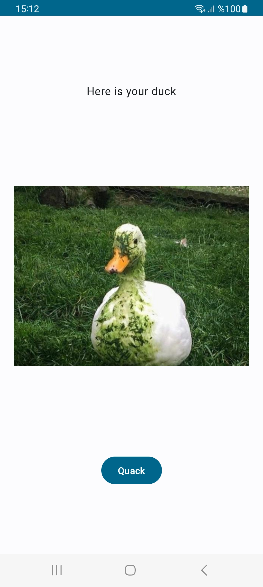
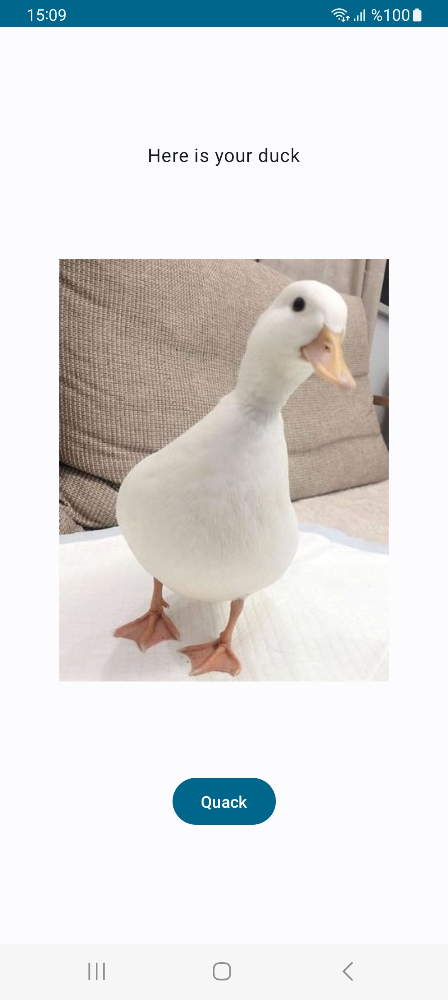
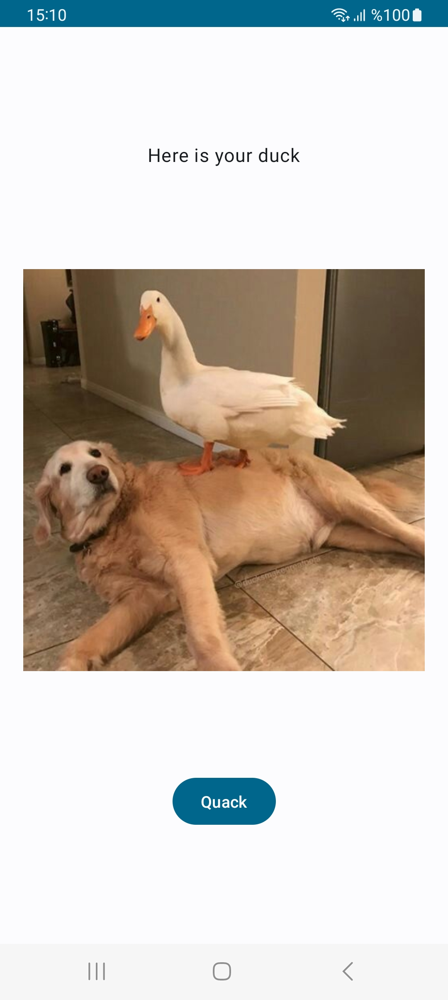
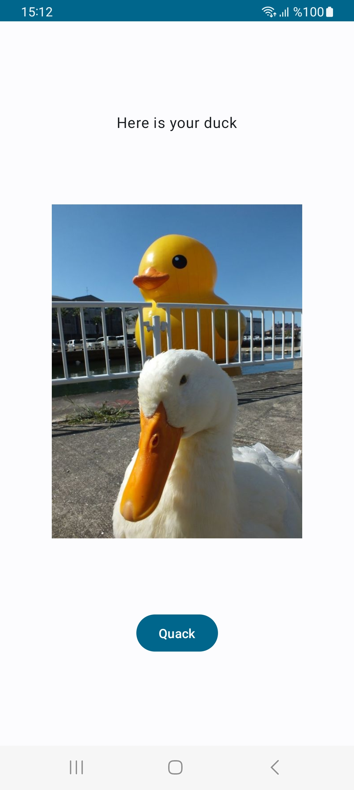

# Quack App

## Description

The Quack App is a simple Android application that displays random duck photos and gifs to the user. The app has only one screen with a "Quack" button, which, when pressed, fetches and displays a new random duck photo or gif on the screen.

## Features

- Display random duck photos and gifs to the user on a single screen.
- Fetch new duck photos from an external API upon pressing the "Quack" button.
- Provides a simple and intuitive user interface.

## Screenshots

                  

## Getting Started

To use the Quack App, follow these steps:

1. Clone the repository to your local machine:

```
git clone https://github.com/atakanakin/Quack.git
```

2. Open the project in Android Studio.

3. Build and run the app on an Android emulator or a physical device.

## Dependencies

### Compose

This app utilizes Jetpack Compose for building the user interface. The following Compose dependencies are used:

- androidx.compose.ui:ui
- androidx.compose.ui:ui-graphics
- androidx.compose.ui:ui-tooling-preview
- androidx.compose.material3:material3
- androidx.lifecycle:lifecycle-viewmodel-compose:1.0.0-alpha07
- androidx.navigation:navigation-compose:2.4.0-alpha08
- com.google.accompanist:accompanist-flowlayout:0.17.0

To add these Compose dependencies to your app, include them in the `dependencies` block in your app-level `build.gradle` file.

### Coroutines

This app uses Kotlin Coroutines for asynchronous programming. The following Coroutines dependencies are included:

- org.jetbrains.kotlinx:kotlinx-coroutines-core:1.5.1
- org.jetbrains.kotlinx:kotlinx-coroutines-android:1.5.1
- androidx.lifecycle:lifecycle-viewmodel-ktx:2.3.1
- androidx.lifecycle:lifecycle-runtime-ktx:2.3.1

These dependencies enable seamless integration of Coroutines with the Android lifecycle.

### Dagger - Hilt

Dependency injection is achieved using Dagger Hilt. The following Hilt dependencies are utilized:

- com.google.dagger:hilt-android:2.47
- com.google.dagger:hilt-compiler:2.47
- androidx.hilt:hilt-navigation-compose:1.1.0-alpha01

These dependencies enable easy management of dependencies and injection of components.

### Retrofit and OkHttp

For network operations, this app uses Retrofit and OkHttp. The following dependencies are added:

- com.squareup.retrofit2:retrofit:2.9.0
- com.squareup.retrofit2:converter-gson:2.9.0
- com.squareup.okhttp3:okhttp:5.0.0-alpha.2
- com.squareup.okhttp3:logging-interceptor:5.0.0-alpha.2

These libraries provide powerful tools for making API calls and handling network requests.

### Glide Compose

To simplify image loading and display, the app uses Glide Compose. The following dependency is included:

- com.github.bumptech.glide:compose:1.0.0-alpha.1

This library is tailored for integrating Glide with Jetpack Compose.

Please ensure that you include these dependencies in your app-level `build.gradle` file as appropriate for your project.

## API Endpoint

- Base URL: https://random-d.uk/

## Fetching a Random Duck Photo or Gif

To fetch a random duck photo or gif, you need to make a GET request to the API endpoint:

- Endpoint: `/api/v2/random`

Example Request:
```
GET https://random-d.uk/api/v2/random
```

Example Response:
```json
{
    "message":"Powered by random-d.uk",
    "url":"https://random-d.uk/api/115.jpg"
}
```

The response will contain a URL that points to the random duck photo. You can use this URL to load the duck photo or gif into your Android app using Glide or any other image loading library.

## API Terms of Use

Please refer to the official API documentation provided by the [https://random-d.uk/](https://random-d.uk/api) for more detailed information about the API and its usage.

## Bugs and Issues

If you encounter any bugs or issues while using the app, please report them in the "Issues" section of the GitHub repository.

## License

This project is licensed under the [MIT License](LICENSE).

## Contact

For any questions or inquiries, feel free to reach out to me at atakanakink@gmail.com.
